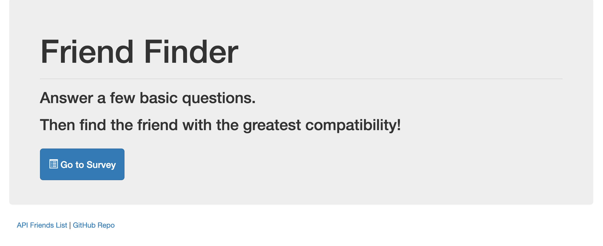
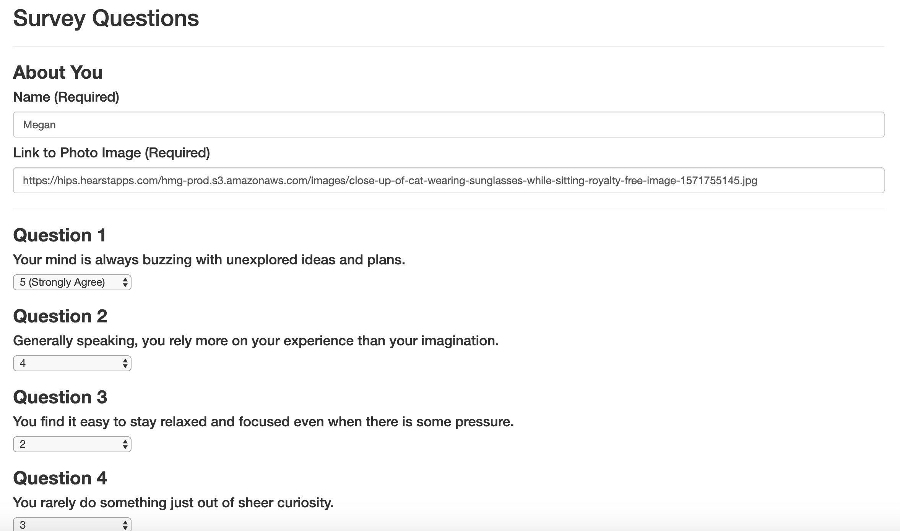
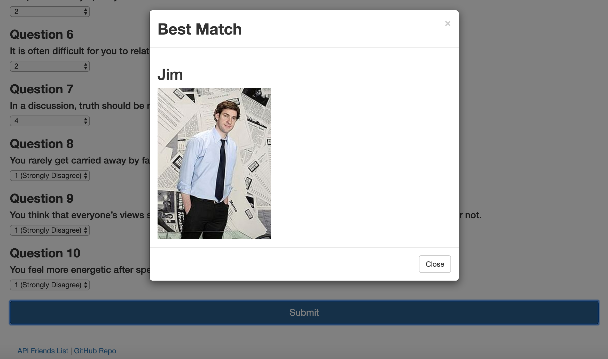
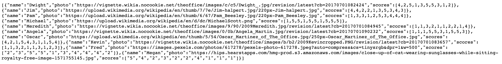

# FriendFinder

# Description
*FriendFinder* implements friend matching based on the user's responses to a ten question survey. The user responds to questions with values from 1 (Strongly Disagree) to 5 (Strongly Agree). When the survey is submitted, an existing user record closest to the current user's responses is found and returned. The closest set of user responses is defined as the set with the lowest absolute difference for all ten questions combined.

Friend Finder application is meant to simulate a simple dating app. The application is implemented using a [Node.js](https://nodejs.org/en/) and [Express](https://expressjs.com/) server on the back end and the [Bootstrap](https://getbootstrap.com/) CSS framework on the front end.

# Demo
*FriendFinder* is deployed to Heroku. You can see the demo here.

# Installation
Please type the following commands into your bash/terminal to install

    $ git clone https://github.com/megswen/FriendFinder.git
    $ cd FriendFinder
    $ npm install

# Running Locally
To run the application locally and access it in your browser, first set the PORT variable in the server.js file to the value of your choice. An example is shown below.

    var PORT = process.env.PORT || 3001;

Once the PORT variable has been set, run the Node.js application with the command below.

    node server.js

The application will now be running locally on PORT, in this case that is port 3001. You can then access it locally from your browser at the URL localhost:PORT, in this case localhost:3001.

# Directions
1. Once on the home page or localhost:3001, click on "Go to Survey".

2. Enter your name, a link to a photo of yourself, and answer the 10 survey questions.

3. When you click submit, the app will take your survey answers and compare them with pre-programmed friends' answers and pair you with the friend whose answers were the least different than your own.

4. The friends API (where the pre-programmed friends are stored) can be found by clicking on the API Friends List link in the footer of the app. You will also see your input on this page.

# Technologies Used
* HTML
* Bootstrap
* Javascript/jQuery
* Node
* Express

# Author
[Megan Swenson](https://github.com/megswen)